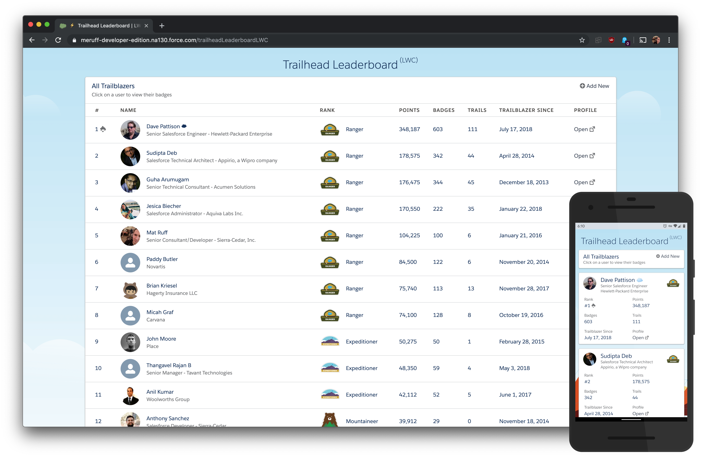

# Trailhead Leaderboard
#### Summary
This is a simple Visualforce page that displays Trailhead Users in a table format. The bulk 
of the work happens in the Apex controller. The controller code calls out to Trailhead and 
scrapes the profile of Users you specify and saves them into a custom Object named 
`Trailblazer__c`. The Visualforce page displays the `Trailblazer__c` records. You can also 
add new users at the bottom of the page by providing their Trailhead User Id.

> **Note:** This works by calling out to Trailhead and parsing the response body of the 
User's Profile. If Salesforce decides to update/change the HTML of the Trailhead site this 
could break at any time. If/when they decide to make api.trailhead.salesforce.com public, I 
will update this to use that instead. 

#### Installation
I prefer the [Force.com Migration Tool](https://developer.salesforce.com/page/Force.com_Migration_Tool). 
You can use the [package.xml](src/package.xml) in this repo.

If you're not as developer-minded, you could also use this super slick tool [Andy in the Cloud](https://andyinthecloud.com) has made
called [Github Salesforce Deploy Tool](https://github.com/afawcett/githubsfdeploy).

#### Adding New "Trailblazers"
To add new Users to the leaderboard, you'll need to first ensure their Trailhead Profile is 
public. To do this, have the User log in to Trailhead and go to their Profile. In the "About Me"
section at the bottom, click the Edit icon in the top right and check "Profile Public". Now all
you have to do is copy the Salesforce Id from the end of the URL and paste it into the Trailhead
Leaderboard at the bottom. The code will automatically pull in the User's data and create a 
new `Trailblazer__c` record for them. If the User already exists in your Salesforce org, the 
page will tell you (yay to keeping the database clean!).

#### Scheduling
You can schedule `PopulateTrailblazers.cls` to run at various intervals to update your 
`Trailblazer__c` by simply going to *Custom Code > Apex Classes > Schedule Apex*. Give your 
job a name, select `PopulateTrailblazers.cls` as your Apex class, and choose a run date/time. 

#### Possible Updates for the Future

- Trailhead public API? (If they ever let us use it)
- ~~Add Badges~~
- ~~Move from Bootstrap 3 to Salesforce Lightning Design System~~
- ~~Test/Mock Classes~~
- Convert to LWC - In Progress

### License
This project is licensed under the MIT License - see the [LICENSE.md](LICENSE.md) file for details

