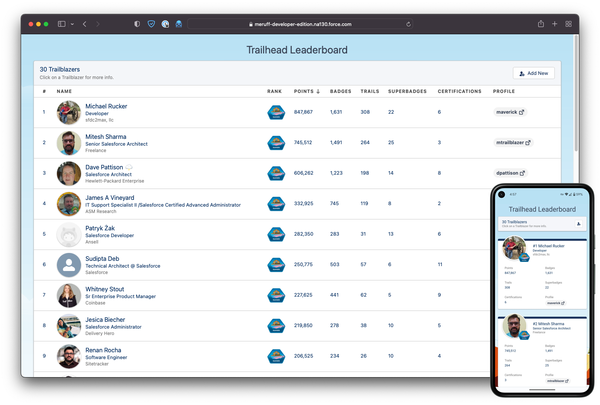

# Trailhead Leaderboard

A Trailhead leaderboard to track your team's progress. Built using Lightning Web Components.

## Description

This app displays Trailhead users on a leaderboard table using Salesforce Lightning
Web Components. The bulk of the work happens in a scheduled Apex class that calls out to a custom
Trailhead API. This API scrapes for and pulls back profile data which is then inserted it into your Salesforce org in a custom
object named `Trailblazer__c`. The page simply queries for and displays the `Trailblazer__c` records.



## Installation

You can deploy this using
the [Salesforce SFDX CLI](https://developer.salesforce.com/docs/atlas.en-us.sfdx_setup.meta/sfdx_setup/sfdx_setup_install_cli.htm)
or [convert it to metadata](https://developer.salesforce.com/docs/atlas.en-us.sfdx_cli_reference.meta/sfdx_cli_reference/cli_reference_force_source.htm)
and use
the [Force.com Migration Tool](https://developer.salesforce.com/docs/atlas.en-us.daas.meta/daas/forcemigrationtool_install.htm)
.

> 🚨 Note: The latest version of the leaderboard uses
> a [middleware API that I've built](https://github.com/meruff/go-trailhead-leaderboard-api) to call directly in the
> Trailhead API to get Profile data. If Salesforce decides to update/change the data on the Trailhead site this could
> break at any time. This site must be set up as a remote site in your Salesforce org in order for callouts to work.


## Usage

### Adding New Trailblazers

To add new Users to the leaderboard, you'll need to first **ensure their Trailhead profile is public**.
In the "About Me" section at the bottom of their profile, click the Edit icon in the top right and
check "Profile Public", then create a custom handle, if you haven't already. Now all you have to do
is enter your handle into the field on the leaderboard by clicking the button at the top right. The page will
automatically pull in the User's data and upsert a new `Trailblazer__c` record for them.

### Scheduling

You can schedule `PopulateTrailblazers` to run at various intervals to update your
`Trailblazer__c` by simply going to *Setup > Custom Code > Apex Classes > Schedule Apex*.
Give your job a name, select `PopulateTrailblazers` as your Apex class, and choose a run
date/time.

Or, you can simply execute the batch manually from anonymous Apex:

```apex
Database.executeBatch(new PopulateTrailblazers());
```

The batch class enqueues a job for each `Trailblazer__c` in your org. For each queued job, it calls out to my middleware
and updates the `Trailblazer__c` record's data. 5 jobs are enqueued at a time (limit for dev orgs). After that it
schedules a new batch to run for the next five while removing the previous `Trailblazer__c` from the queue until its
finished.

## Roadmap

- ~~Add Badges~~
- ~~Move from Bootstrap 3 to Salesforce Lightning Design System~~
- ~~Test/Mock Classes~~
- ~~Convert to Lightning Web Components ⚡~~
- ~~Convert to Salesforce DX Project~~
- ~~Add a custom Trailhead API~~
- Dark mode? 😎
- Pagination / loading more.
- Handle deactivating Trailblazers who go private / 404.
- Remove `Badge__c`.

## License

This project is licensed under the MIT License - see the [LICENSE.md](LICENSE.md) file for details.
